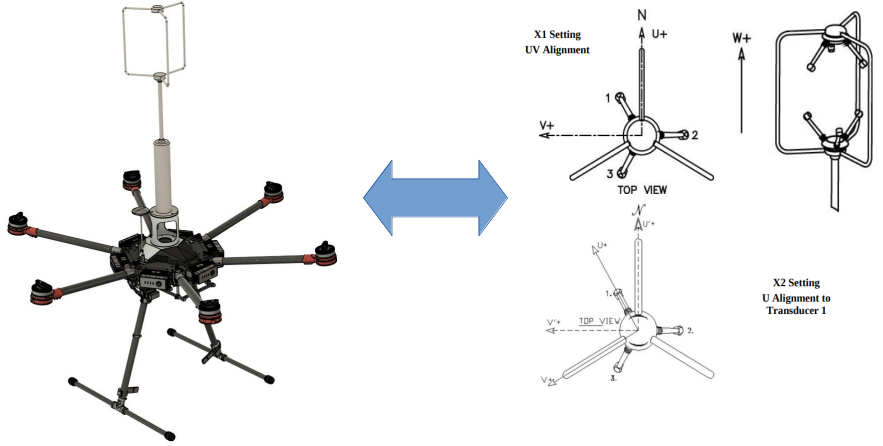

# wind_velocity_calculator



This package is an alternative to calculate georeferenced wind velocities for drones equipped with an anemometer a GPS and an IMU.

According to the velocity triangle, the absolute velocity of an aircraft is a vector sum of the air relative velocity and wind velocity. Absolute velocities are measured and/or estimated with a certain degree of accuracy. The air relative velocity can also be measured with instruments, such as an anemometer for quadrotors or pitot tube for fixed wing aircraft. With those measurements the anemometer velocity relative to the body can be found and the wind velocity can be calculated.

## Installation
Firstly, be sure you have [mav_comm](http://wiki.ros.org/mav_comm) installed or cloned to your workspace.
To install this package, proceed the following steps:

```bash
cd ~/your_workspace/src
git clone https://gitlab.com/gscar-coppe-ufrj/ariel/ros/wind_velocity_calculator.git
source ~/your_workspace/devel/setup.bash
catkin build wind_velocity_calculator
```

## Configure
Edit the file `wind_velocity_calculator/config/config.yaml` with your drone's according linear velocity (`drone_linear_velocity_topic`), angular velocity (`drone_angular_velocity_topic`) and orientation (`drone_orientation_topic`) topics. Edit your air relative velocity input topic (`anemometer_relative_velocity_topic`) and name the topic where you wish to see the information (`wind_velocity_topic`).

Last but not least, the anemometer's ```measurement_link``` pose relative to the body will be searched in the tf tree. If it gets found (if a static transform publisher provides a tf from ```anemometer_link``` to ```drone_base_link```), there's no need of further configurations. However, if it doesn't, configure your sensor's position and orientation relative to the body (`anemometer_position`, `anemometer_orientation`) according to the first figure. Position is pretty straight forward and orientation is represented as rotation matrix following the ZYX convention.

## Usage

To run the node, open a terminal and type the following commands
```bash
source ~/your_workspace/devel/setup.bash
roslaunch wind_velocity_calculator wind_velocity_calculator.launch
```
The output wind velocity can be seen in the configured wind velocity topic. Improved measurements are available when gps_health is good (>2). In case of a bad gps_health, wind velocity measurements are valid only when the drone is steadily hovering.

## Contributing
Pull requests are welcome. For major changes, please open an issue first to discuss what you would like to change.
